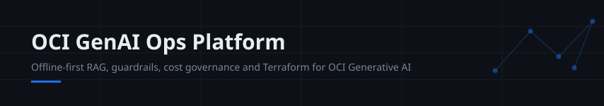
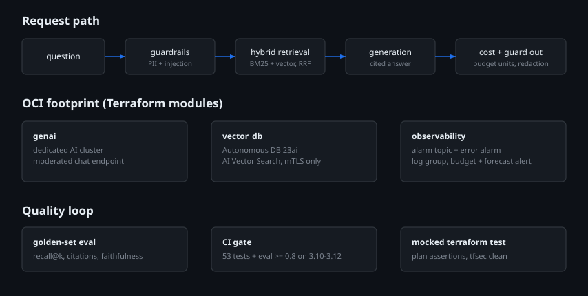

# oci-genai-ops-platform

An offline-first, end-to-end **OCI Generative AI operations platform**: hybrid-retrieval RAG pipeline, guardrails, cost governance, observability and golden-set evaluation, plus Terraform modules for the OCI footprint (GenAI dedicated cluster, vector database, monitoring, budget guardrails).

**Portfolio project.** Built and tested entirely offline with fixtures, deterministic local embeddings and mocked Terraform providers. It has **not** been applied to a live OCI tenancy and carries no production metrics.

## What's inside

| Layer | Module | What it does |
| --- | --- | --- |
| Retrieval | `src/genai_ops/retrieval.py` | BM25 + vector hybrid with reciprocal rank fusion |
| Embeddings | `src/genai_ops/embeddings.py` | Deterministic hashing embedder (OCI GenAI embeddings stand-in) |
| Vector store | `src/genai_ops/vectorstore.py` | In-memory store, JSON persistence, cosine search |
| Generation | `src/genai_ops/generation.py` | Offline extractive client with mandatory citations; `LLMClient` seam for a real OCI client |
| Guardrails | `src/genai_ops/guardrails.py` | PII redaction (email/phone/card/OCID), prompt-injection screening |
| Cost | `src/genai_ops/costguard.py` | Token accounting, monthly budget units, warn-before-exceed |
| Observability | `src/genai_ops/observability.py` | Counters, latency histograms, trace spans, structured JSON logs |
| Evaluation | `src/genai_ops/eval.py` | Golden-set harness: recall@k, citation coverage, faithfulness |
| Infra | `terraform/` | GenAI cluster + endpoint, Autonomous DB (23ai vector), alarms, log group, budget + forecast alert |

## Architecture



## Quickstart

```bash
# run the golden-set evaluation gate (no dependencies beyond stdlib)
PYTHONPATH=src python -m genai_ops.cli eval fixtures/docs fixtures/golden_eval.json --min-pass 0.8

# ingest docs and ask a question
PYTHONPATH=src python -m genai_ops.cli ingest fixtures/docs --store build_store.json
PYTHONPATH=src python -m genai_ops.cli query "How do OCI budgets alert on spending?" --store build_store.json
```

Current eval on the shipped fixture set: **5/5 pass, recall@4 = 1.0, mean faithfulness 0.94** (deterministic, reproduced by CI on every push).

## CI

- Python 3.10-3.12: 53 unit tests, CLI smoke, golden-set eval gate (min pass 0.8)
- Terraform: `fmt -check`, `validate`, mocked `terraform test` (3 plan assertions), `tfsec`

## Terraform

`terraform/environments/dev` composes three modules: `genai` (dedicated AI cluster + moderated endpoint), `vector_db` (Autonomous DB 23ai, mTLS, no 0.0.0.0/0), `observability` (alarm topic, error alarm, log group, monthly budget + 80% forecast alert). Mocked-provider tests assert the guardrails: forecast-based budget alerts, no world-open database, enabled alarms. Nothing here has been applied; there is no state file.

## Honest limitations

- The embedder is lexical, not semantic; swap in OCI GenAI embeddings behind `HashingEmbedder`'s interface for real use.
- The extractive generator is a teaching stand-in; `MockOCIClient` and the `LLMClient` protocol mark where a real endpoint client goes.
- Terraform modules are validated and mock-tested, never applied.

See `docs/ARCHITECTURE.md`, `docs/RUNBOOK.md`, `docs/SECURITY.md` and `docs/adr/` for design detail.
